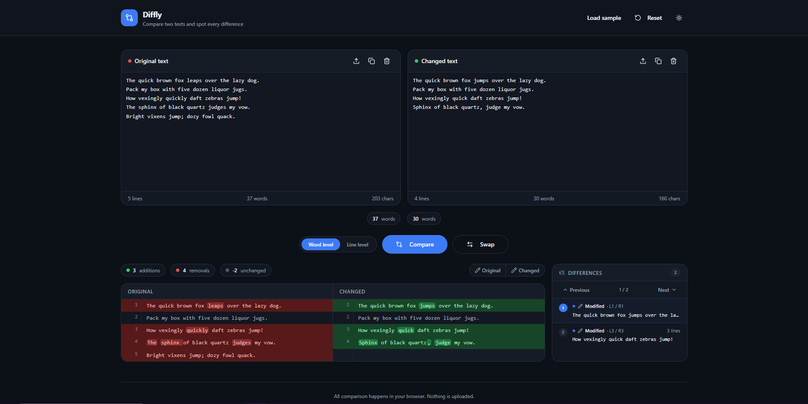
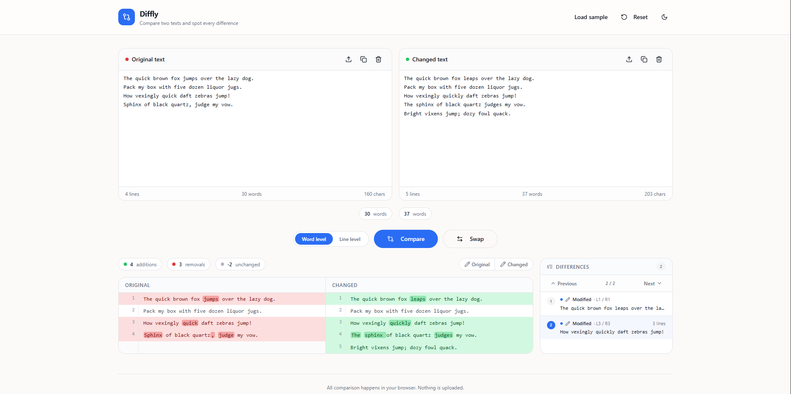

# Text Comparer App

A simple and efficient web application for comparing two texts side by side. Built with React.js and Vite, the app helps users quickly identify differences between texts with word-level and line-level comparison tools.

---

## Features

- Import files for comparing
- Word-level comparison
- Line-level comparison
- List of changes to track differences
- Copy text options
- Light and Dark mode
- Word counts for both texts
- Responsive and clean UI

---

## Tech Stack

- React.js
- Vite
- JavaScript
- CSS

---

## Live Demo

[Open App](https://nitagashi.github.io/text-comparer-app/)

---

## Usage

1. Paste or type text into both editors
2. Import text files if needed
3. Choose comparison mode
4. Review highlighted differences
5. Copy compared text easily

---

## Screenshots

### Main Dashboard

### Comparison View

---

## Project Status

Currently in progress and actively being improved.

---

## Future Improvements

- Export comparison results
- Better diff visualisation
- Drag and drop file uploads
- Syntax highlighting
- Multi-language support

---

## GitHub Repository

[GitHub Repository](https://github.com/nitagashi/text-comparer-app)

---

## Author

Created by [Nita Gashi](https://github.com/nitagashi)
